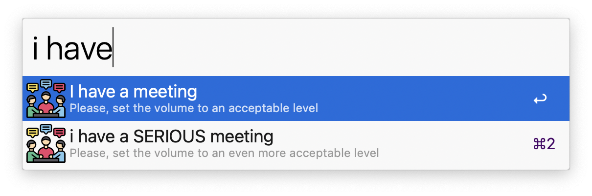

# I Have a Meeting
An Alfred workflow that allows to quickly turn down the volume of the Music app to a level that allows you to enjoy music while being on a meeting :)

## Usage
Simply invoke it by writing `i have a meeting`. This will lower the volume to 10% in Apple Music. If you have a **serious** meeting then invoke `i have a SERIOUS meeting` which will set the volume to 2%.

Once you're done with it and ready to headbang at full volume, simple invoke `meeting done` or the short version `done`, which will put the volume back to 100%.
